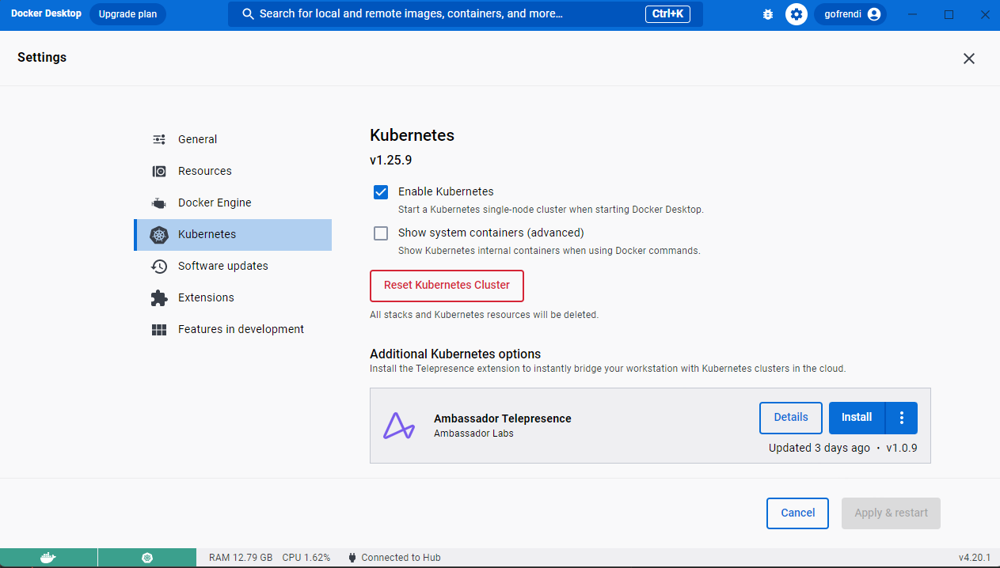

🔖 [Table of Contents](../README.md) / [Tutorials](README.md)

# Development to deployment: Low code

In this demo, you will see how you can use [zrb](https://pypi.org/project/zrb) to:

- Create a CRUD application.
- Add some entities/fields.
- Run the application as monolith/microservices.
- Containerize your application.
- Deploy the application to a Kubernetes cluster.

No coding skill is required.

# Start the demo

Before starting the demo, you need to make sure you have the following software installed:

- Python (3.9 or higher)
- Pip
- Venv
- Docker (with Docker Compose extension)
- Pulumi
- Node.Js
- Npm
- Zrb
- Access to a Kubernetes cluster

> __📝 NOTE:__ Installing docker desktop will give you docker + docker compose extension, as well as local kubernetes cluster (if enabled).

Once everything is set, you can run the following commands on your terminal:

```bash
echo "👷 Crete my-project"
zrb project create --project-dir my-project --project-name "My Project"
cd my-project
source project.sh

echo "👷 Add fastapp"
zrb project add fastapp --project-dir . --app-name "myapp" --http-port 3000

echo "👷 Add library module"
zrb project add fastapp-module --project-dir . --app-name "myapp" --module-name "library"

echo "👷 Add book entity"
zrb project add fastapp-crud --project-dir . --app-name "myapp" --module-name "library" \
    --entity-name "book" --plural-entity-name "books" --column-name "code"

echo "👷 Add title field"
zrb project add fastapp-field --project-dir . --app-name "myapp" --module-name "library" \
    --entity-name "book" --column-name "title" --column-type "str"

echo "👷 Start fastapp"
zrb project start-myapp --myapp-run-mode "monolith"
```

The commands will give you:

- A folder named `my-project`.
- A Python application under the project (`my-project/src/myapp`).
- A `library` module under the application (`myproject/src/myapp/src/module/library`)
- A `book` entity under the `library` module.
- A field named `title` under the `book` entity.

It will also run the application on your local computer.

# Open myapp from the browser

You can visit [http://localhost:3000](http://localhost:3000) to see how the application works.

The default username and password will be `root` and `toor`.

Try to add some books.


# Override default username and password

You can override the system username and password by setting some environment variables:

```bash
# press ctrl + c to stop the application
export MYAPP_APP_AUTH_ADMIN_USERNAME=gofrendi
export MYAPP_APP_AUTH_ADMIN_PASSWORD=aVeryStrongPassword73
zrb project start-myapp --myapp-run-mode "monolith"
```

# Checking the process

Currently, `myapp` is running as a single process in your local computer.

Let's confirm this by openning a new terminal and invoking the following command:

```bash
pgrep uvicorn -a
```

You should see a single process to this:

```
4001 ... main:app --host 0.0.0.0 --port 3000 --reload --reload-include index.html
```

# Run Myapp as microservices

Now let's go back to your first terminal, so that you can kill `my-app` process by pressing `ctrl + c`.

Stay in your first terminal, and try to invoke the following command:

```bash
zrb project start-myapp --myapp-run-mode "microservices"
```

Once started, you will be able to access [http://localhost:3000](http://localhost:3000) as what you have done previously.

Now let's invoke the following command on your second terminal:

```bash
pgrep uvicorn -a
```

```
5305 ... main:app --host 0.0.0.0 --port 3000 --reload --reload-include index.html
5307 ... main:app --host 0.0.0.0 --port 3001 --reload --reload-include index.html
5309 ... main:app --host 0.0.0.0 --port 3002 --reload --reload-include index.html
5311 ... main:app --host 0.0.0.0 --port 3003 --reload --reload-include index.html
```

You can see that now you have multiple processes.

Each processes handle different aspect of the application:

- `myapp-gateway` (port: 3000)
    - Handle HTTP request from user
    - Send RPC request to other services
    - Consume RPC reply from other services
- `myapp-auth-service` (port: 3001)
    - Handle RPC request related to authentication/authorization
    - Send RPC response to gateway
- `myapp-log-service` (port: 3002)
    - Handle RPC request related to user activity/entities change history
    - Send RPC response to gateway
- `myapp-library-service` (port: 3002)
    - Handle RPC request related to book management
    - Send RPC response to gateway

You can see that you can run `myapp` as either microservices as monolith. When in doubt, start with monolith.

# Run Myapp as containers

Now let's run `myapp` as containers.

Let's go back to your first terminal, and kill the running process by pressing `ctrl + c`.

To run `myapp` as containers you can invoke:

```bash
zrb project start-myapp-container --myapp-run-mode microservices
```

> __📝 NOTE:__ You can also run the container as a monolith if you want to. Just invoke `zrb project start-myapp-container --myapp-run-mode monolith`

Now let's see how things look like by invoking:

```bash
docker ps
```

```
CONTAINER ID   IMAGE                   ...  PORTS                    NAMES
868a7e089983   gofrendi/myapp:latest   ...  0.0.0.0:3003->3003/tcp   myapp_library_service
022bd4d3c86c   rabbitmq:3-management   ...  4369/tcp, 5671/tcp ...   myapp_rabbitmq
afcdbface5b0   adminer                 ...  0.0.0.0:9001->8080/tcp   myapp_adminer
cd5fa960db85   gofrendi/myapp:latest   ...  0.0.0.0:3002->3002/tcp   myapp_log
5ea14febc9a2   gofrendi/myapp:latest   ...  0.0.0.0:3001->3001/tcp   myapp-auth
94d382af67ed   gofrendi/myapp:latest   ...  0.0.0.0:3000->3000/tcp   myapp_gateway
20b30ae224d1   postgres:15.2           ...  0.0.0.0:5432->5432/tcp   myapp_postgresql
```

You will still able to access [http://localhost:3000](http://localhost:3000) as you previously do. The application is now running as containers.

You can stop the container by pressing `ctrl + c` in your first terminal.

Make sure to also run `zrb project stop-myapp-container` to prevent your containers to be auto-started.

# Deploying Myapp to Kubernetes

For this demo, we are using docker desktop with kubernetes enabled.



Once your kubernetes cluster is running, you can invoke the following command:

```bash
docker login
zrb project deploy-myapp --myapp-deploy-mode microservices
```

Now let's invoke `kubectl get pods` and see how the pods are running

```
NAME                                             READY   STATUS    RESTARTS        AGE
myapp-auth-service-f8ae1d6e-85f4c9546b-snxsg     1/1     Running   0               11m
myapp-gateway-1ef04e6a-675c677c99-cnlj4          1/1     Running   0               11m
myapp-library-service-ea122a8e-cd66f54db-hgkvf   1/1     Running   0               11m
myapp-log-service-2985aef5-6fbcdd8fbd-jfg28      1/1     Running   0               11m
postgresql-0                                     1/1     Running   0               14m
rabbitmq-0                                       1/1     Running   0               76s
```

You can also invoke `kubectl get services` to see how the network is configured

```
NAME                     TYPE           CLUSTER-IP       EXTERNAL-IP   PORT(S)                 AGE
kubernetes               ClusterIP      10.96.0.1        <none>        443/TCP                 12h
myapp-gateway-e212b722   LoadBalancer   10.106.184.165   localhost     3000:31723/TCP          14m
postgresql               ClusterIP      10.108.147.124   <none>        5432/TCP                17m
postgresql-hl            ClusterIP      None             <none>        5432/TCP                17m
rabbitmq                 ClusterIP      10.104.181.249   <none>        5672/TCP,4369/TCP,...   17m
rabbitmq-headless        ClusterIP      None             <none>        4369/TCP,5672/TCP,...   17m
```

And as always you you can access [http://localhost:3000](http://localhost:3000).

# Conclusion

You have see how you can create, run, and deploy application quickly.


🔖 [Table of Contents](../README.md) / [Tutorials](README.md)
