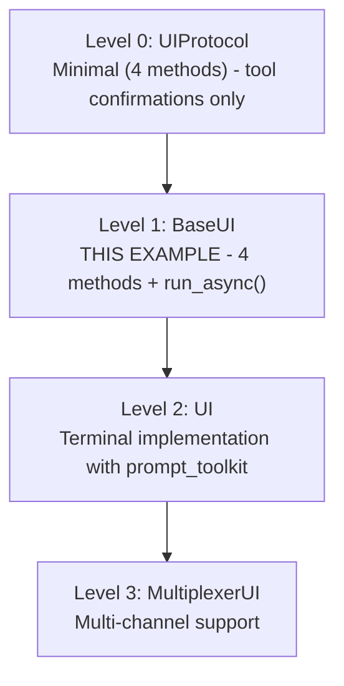

# Minimal UI Example

This example demonstrates how to create custom UI backends for Zrb's LLM Chat using `BaseUI`.

## Extension Levels

Zrb provides multiple levels for extending the UI:



| Level | Base Class | Description |
|-------|------------|-------------|
| **0** | `UIProtocol` | Minimal 4 methods - tool confirmations only |
| **1** | `BaseUI` | THIS EXAMPLE - 4 methods + run_async() |
| **2** | `UI` | Terminal implementation with prompt_toolkit |
| **3** | `MultiplexerUI` | Multi-channel support |

## How It Works

The key insight: We **hijack** the built-in `llm_chat` task by setting our own UI factory.

```python
from zrb.builtin.llm.chat import llm_chat
from zrb.llm.ui.base_ui import BaseUI

class MyUI(BaseUI):
    def append_to_output(self, *values, sep=" ", end="\n", **kwargs):
        # Your output logic here
        ...

    async def ask_user(self, prompt: str) -> str:
        # Your input logic here
        ...

    async def run_interactive_command(self, cmd, shell=False):
        # Optional: shell command execution
        ...

    async def run_async(self) -> str:
        # Your event loop here
        ...

def create_ui(ctx, llm_task, history_manager, ...):
    return MyUI(ctx, llm_task, history_manager, ...)

# Set UI factory on the built-in task
llm_chat.set_ui_factory(create_ui)

# User runs: zrb llm chat
```

This is exactly how `examples/telegram-cli/` works - it sets a custom UI factory on `llm_chat`, so when you run `zrb llm chat`, it uses the custom UI.

## Quick Start

```bash
# Run the built-in chat command with minimal UI
cd examples/chat-minimal-ui
zrb llm chat

# With initial message
zrb llm chat --message "Hello, how are you?"

# With session persistence
zrb llm chat --session "my-conversation"

# With logging to file
ZRB_CHAT_LOG_FILE=chat.log zrb llm chat
```

## Required Methods

When extending `BaseUI`, you must implement these 4 methods:

| Method | Purpose | Signature |
|--------|---------|-----------|
| `append_to_output` | Render output to user | `def append_to_output(self, *values, sep=" ", end="\n", **kwargs)` |
| `ask_user` | Get user input | `async def ask_user(self, prompt: str) -> str` |
| `run_interactive_command` | Execute shell commands | `async def run_interactive_command(self, cmd, shell=False)` |
| `run_async` | Run the UI event loop | `async def run_async(self) -> str` |

## Example Implementations

### Basic Terminal UI

```python
import asyncio
from zrb.llm.ui.base_ui import BaseUI

class TerminalUI(BaseUI):
    def append_to_output(self, *values, sep=" ", end="\n", **kwargs):
        content = sep.join(str(v) for v in values) + end
        print(content, end="", flush=True)

    async def ask_user(self, prompt: str) -> str:
        if prompt:
            print(prompt, end="", flush=True)
        loop = asyncio.get_running_loop()
        return await loop.run_in_executor(None, input)

    async def run_interactive_command(self, cmd, shell=False):
        proc = await asyncio.create_subprocess_shell(cmd, shell=shell)
        await proc.wait()

    async def run_async(self) -> str:
        self._process_messages_task = asyncio.create_task(
            self._process_messages_loop()
        )
        if self._initial_message:
            self._submit_user_message(self._llm_task, self._initial_message)
        self._running = True
        try:
            while self._running:
                await asyncio.sleep(0.1)
        except asyncio.CancelledError:
            pass
        finally:
            self._process_messages_task.cancel()
        return self.last_output
```

### WebSocket Backend

```python
import asyncio
from zrb.llm.ui.base_ui import BaseUI

class WebSocketUI(BaseUI):
    def __init__(self, websocket, *args, **kwargs):
        super().__init__(*args, **kwargs)
        self.ws = websocket
        self._input_queue = asyncio.Queue()

    def append_to_output(self, *values, sep=" ", end="\n", **kwargs):
        msg = sep.join(str(v) for v in values) + end
        asyncio.create_task(self.ws.send(msg))

    async def ask_user(self, prompt: str) -> str:
        if prompt:
            await self.ws.send(prompt)
        return await self._input_queue.get()

    async def run_interactive_command(self, cmd, shell=False):
        # Shell commands not supported in WebSocket
        await self.ws.send(f"[Shell commands not supported]")
        return 1

    async def run_async(self) -> str:
        # Start message processing
        self._process_messages_task = asyncio.create_task(
            self._process_messages_loop()
        )

        # Handle WebSocket message receiving
        async def receive_messages():
            async for msg in self.ws:
                data = json.loads(msg)
                if data.get("type") == "user_input":
                    await self._input_queue.put(data["content"])
                # Handle other message types...

        receive_task = asyncio.create_task(receive_messages())

        if self._initial_message:
            self._submit_user_message(self._llm_task, self._initial_message)

        try:
            while True:
                await asyncio.sleep(1)
        except asyncio.CancelledError:
            pass
        finally:
            receive_task.cancel()
            self._process_messages_task.cancel()
```

### Telegram Bot (Event-Driven Pattern)

For a complete Telegram implementation, see `examples/telegram-cli/zrb_init.py`.

Key pattern: Unlike request-response backends (WebSocket), Telegram requires:
1. Bot polling setup
2. Message routing (commands vs chat vs ask_user responses)
3. Callback query handling for approvals

```python
# See examples/telegram-cli/ for full implementation
# Key difference: Event-driven, not request-response
```

## Optional Methods

You can also override these methods:

| Method | Purpose |
|--------|---------|
| `on_exit()` | Cleanup when UI closes |
| `invalidate_ui()` | Refresh UI state |
| `stream_to_parent()` | For multiplexer setups |

## Comparison: BaseUI Use Cases

| Backend Type | Pattern | Key Consideration |
|--------------|---------|-------------------|
| Terminal | Request-response | Straightforward `ask_user()` |
| WebSocket | Request-response | Straightforward `ask_user()` |
| HTTP API | Request-response | Straightforward `ask_user()` |
| Telegram | **Event-driven** | Need message routing and `ask_user` queue |
| Discord | **Event-driven** | Need message routing and `ask_user` queue |
| WhatsApp | **Event-driven** | Need message routing and `ask_user` queue |

For event-driven backends, see `examples/telegram-cli/` for the complete pattern.

## Related Files

- `src/zrb/llm/ui/base_ui.py` - BaseUI base class
- `src/zrb/llm/ui/default_ui.py` - Terminal UI implementation (full TUI)
- `examples/telegram-cli/zrb_init.py` - Telegram multiplexer example
- `src/zrb/llm/approval/` - Multi-channel approval system

## Further Reading

- [BaseUI Documentation](../../src/zrb/llm/ui/base_ui.py) - Full API docs
- [UI Protocol](../../src/zrb/llm/tool_call/ui_protocol.py) - Minimal interface
- [Approval System](../../src/zrb/llm/approval/) - Tool approval channels