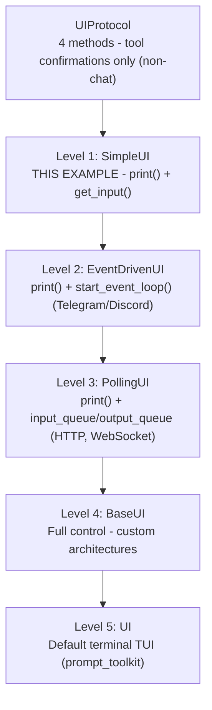

# Minimal UI Example

This example demonstrates the **simplest** way to create a custom UI backend for
Zrb's LLM Chat using `SimpleUI`. You only implement **2 methods** — `print()` and
`get_input()` — and `SimpleUI` handles the message loop, command processing, and
tool approvals for you.

See [`zrb_init.py`](./zrb_init.py) for the full ~40-line implementation.

## Extension Levels

Zrb provides several levels for extending the chat UI, in increasing order of
control (and effort). Pick the lowest level that fits your backend:



| Level | Base Class | Implement | Best for |
|-------|------------|-----------|----------|
| — | `UIProtocol` | 4 methods | Tool confirmations in non-chat contexts |
| **1** | `SimpleUI` | `print()`, `get_input()` | **THIS EXAMPLE** — CLI, file logging, simple backends |
| **2** | `EventDrivenUI` | `print()`, `start_event_loop()` | Telegram, Discord, WhatsApp (callback-based) |
| **3** | `PollingUI` | `print()` | HTTP API, WebSocket polling |
| **4** | `BaseUI` | `append_to_output()`, `ask_user()`, `run_interactive_command()`, `run_async()` | Maximum flexibility, custom architectures |
| **5** | `UI` | — | Default terminal TUI (used when no custom UI is set) |

## How It Works

The key idea: we **set our own UI factory** on the built-in `llm_chat` task. When
the user runs `zrb llm chat`, it uses our UI instead of the default terminal one.

```python
import asyncio
import os

from zrb.builtin.llm.chat import llm_chat
from zrb.llm.ui import SimpleUI, create_ui_factory


class MinimalUI(SimpleUI):
    """The simplest possible UI - just implement print() and get_input()."""

    async def print(self, text: str, kind: str = "text") -> None:
        # Display output to the user. MUST be async — SimpleUI schedules it
        # via asyncio.create_task().
        print(text, end="", flush=True)

    async def get_input(self, prompt: str) -> str:
        if prompt:
            print(prompt, end="", flush=True)
        loop = asyncio.get_running_loop()
        return await loop.run_in_executor(None, input, "You> ")


# create_ui_factory wires the factory parameters for you — one line.
llm_chat.set_ui_factory(create_ui_factory(MinimalUI))

# User runs: zrb llm chat
```

`create_ui_factory(MinimalUI, **kwargs)` forwards any extra keyword arguments to
your `MinimalUI.__init__`, so you can pass configuration (a log file path, a
client handle, etc.) without writing a factory function by hand.

## Required Methods

When extending `SimpleUI`, you implement just these 2 methods:

| Method | Purpose | Signature |
|--------|---------|-----------|
| `print` | Render output to the user | `async def print(self, text: str, kind: str = "text") -> None` |
| `get_input` | Get user input | `async def get_input(self, prompt: str) -> str` |

> Both methods are **async**. `SimpleUI` drives output through
> `asyncio.create_task()`, so `print()` must be a coroutine even if your body is
> synchronous.

## Quick Start

```bash
# Run the built-in chat command with the minimal UI
cd examples/chat-minimal-ui
zrb llm chat

# With an initial message
zrb llm chat --message "Hello, how are you?"

# With session persistence
zrb llm chat --session "my-conversation"

# With logging to a file (this example reads ZRB_CHAT_LOG_FILE)
ZRB_CHAT_LOG_FILE=chat.log zrb llm chat
```

## Going Further

- **Event-driven backends** (Telegram, Discord) — extend `EventDrivenUI` and
  implement `start_event_loop()`. See [`examples/chat-telegram/`](../chat-telegram/).
- **Polling/streaming backends** (HTTP, SSE) — extend `PollingUI` and use the
  built-in `input_queue` / `output_queue`. See [`examples/chat-sse/`](../chat-sse/).
- **Dual mode** (CLI *and* an external channel) — use
  `llm_chat.append_ui_factory(...)` to broadcast to multiple channels at once.

## Related Files

- `src/zrb/llm/ui/__init__.py` — UI package docstring with the full class hierarchy
- `src/zrb/llm/ui/simple_ui_base.py` — `SimpleUI` base class
- `src/zrb/llm/ui/base/ui.py` — `BaseUI` (advanced) base class
- `src/zrb/llm/ui/default/ui.py` — default terminal UI (full TUI)
- `src/zrb/llm/ui/ui_factory.py` — `create_ui_factory` and friends
- `examples/chat-telegram/zrb_init.py` — event-driven multi-channel example
