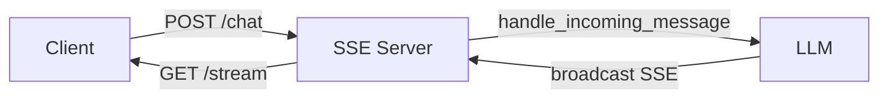

# SSE Chat Example

Server-Sent Events (SSE) + CLI dual mode for real-time LLM chat. No polling, no missed messages!

This example provides **CLI + SSE dual mode** chat with full tool approval support (approve/deny/edit).

## Architecture



**Key: `handle_incoming_message()` routes correctly:**
- If LLM is waiting on `get_input()` (e.g., asking a question) → unblocks it
- If LLM is idle → starts a new conversation turn

**SSE ensures no missed messages:**
- Client stays connected to `/stream`
- All output is broadcast in real-time
- Automatic keepalive prevents timeout

## Quick Start

```bash
# Terminal 1: Start the server (requires a terminal for CLI mode)
export OPENAI_API_KEY="your-key"
cd /path/to/zrb/examples/chat-sse
zrb llm chat
```

```bash
# Terminal 2: Connect to SSE stream (stays connected)
curl -N http://localhost:8000/stream
```

```bash
# Terminal 3: Send messages via HTTP
curl -X POST http://localhost:8000/chat \
  -H "Content-Type: application/json" \
  -d '{"message": "Hello!"}'

# Or type in Terminal 1's CLI!
```

## Environment Variables

| Variable | Default | Description |
|----------|---------|-------------|
| `SSE_HOST` | `localhost` | Server bind address |
| `SSE_PORT` | `8000` | Server port |

## API Endpoints

### POST /chat

Send a message to the LLM or respond to tool approval prompts.

**Request:**
```json
{"message": "Hello!"}
```

**Response:**
```json
{"status": "sent", "message": "Hello!"}
```

**Response when handling approval:**
```json
{"status": "approval_handled", "message": "y"}
```

**Response when editing tool args:**
```json
{"status": "edit_received", "message": {"path": "/home/user"}}
```

### GET /stream

Server-Sent Events endpoint. Connect and receive all LLM output in real-time.

**Response Format:**
```
event: connected
data: {"status": "connected"}

data: "AI: Hello! How can I help you?"

data: "I'm thinking..."

data: "The answer is 42."
```

**Keep Connected:** The connection stays open. Keepalive comments (`: keepalive`) are sent every 30 seconds.

### GET /status

Check session status.

**Response:**
```json
{
  "waiting_for_input": false,
  "session_name": "random-session-name"
}
```

### GET /history

Get conversation history. Useful for resuming after disconnecting.

**Query Parameters:**
| Param | Default | Description |
|-------|---------|-------------|
| `session` | current | Session name to load |
| `format` | `text` | Output format: `text` or `json` |
| `max_length` | `10000` | Max characters (for text format) |

### GET /pending

Get pending tool approvals that require user action.

**Response:**
```json
{
  "pending_approvals": [
    {
      "tool_call_id": "call_abc123",
      "tool_name": "Read",
      "tool_args": {"path": "/path/to/file.txt"}
    }
  ]
}
```

---

## Tool Approval (Complete Guide)

When the LLM wants to use a tool, the SSE stream shows:

```
data: "🎰 Tool 'LS'"
data: "Args:"
data: "```json"
data: "{"
data: "  \"path\": \"/tmp\""
data: "}"
data: "```"
data: "❓ Approve? (y/yes = approve, n/no = deny, e/edit = edit args)"
```

### Quick Reference

| Response | Action |
|----------|--------|
| `y` or `yes` or `ok` or empty | Approve and execute |
| `n` or `no` or `deny` | Deny, tool not executed |
| `e` or `edit` | Enter edit mode |

### Approve Tool

**SSE shows:** `❓ Approve? (y/yes = approve, n/no = deny, e/edit = edit args)`

**You send:**
```bash
curl -X POST http://localhost:8000/chat \
  -H "Content-Type: application/json" \
  -d '{"message": "y"}'
```

**SSE confirms:** `✅ Tool 'LS' approved`

### Deny Tool

**SSE shows:** `❓ Approve? (y/yes = approve, n/no = deny, e/edit = edit args)`

**You send:**
```bash
curl -X POST http://localhost:8000/chat \
  -H "Content-Type: application/json" \
  -d '{"message": "n"}'
```

**SSE confirms:** `🛑 Tool 'LS' denied`

### Edit Tool Arguments (Two-Step Flow)

**IMPORTANT:** Never send JSON args directly. Always follow the two-step flow:

1. First send `"e"` to enter edit mode
2. Then send the JSON args

Sending JSON without first sending `"e"` will result in an error.

**Step 1: Request edit mode**

**SSE shows:** `❓ Approve? (y/yes = approve, n/no = deny, e/edit = edit args)`

**You send:**
```bash
curl -X POST http://localhost:8000/chat \
  -H "Content-Type: application/json" \
  -d '{"message": "e"}'
```

**Step 2: Server shows current args with edit instructions**

SSE broadcasts something like:
```
✏️ Editing tool 'LS'

Current args:
```json
{
  "path": "/tmp"
}
```

Send modified args as JSON object:
```
curl -X POST http://localhost:8000/chat \
  -H 'Content-Type: application/json' \
  -d '{"message": {"path": "/tmp"}}'
```

Modify the values inside `message` as needed.
```

**Step 3: Send modified args**

Copy the curl command from SSE and modify the values:

```bash
# Change path from /tmp to /home/user
curl -X POST http://localhost:8000/chat \
  -H "Content-Type: application/json" \
  -d '{"message": {"path": "/home/user"}}'
```

**SSE confirms:** `✅ Tool 'LS' approved` (with modified args)

---

## Complete Example: Reading a File

### Terminal 1: Start Server
```bash
export OPENAI_API_KEY="your-key"
cd examples/chat-sse
zrb llm chat
```

### Terminal 2: Watch SSE Stream
```bash
curl -N http://localhost:8000/stream
```

### Terminal 3: Interact

**1. Ask LLM to list a directory:**
```bash
curl -X POST http://localhost:8000/chat \
  -H "Content-Type: application/json" \
  -d '{"message": "Please list the contents of /tmp"}'
```

**2. SSE shows approval request:**
```
data: "🎰 Tool 'LS'"
data: "Args:"
data: "```json"
data: "{"
data: "  \"path\": \"/tmp\""
data: "}"
data: "```"
data: "❓ Approve? (y/yes = approve, n/no = deny, e/edit = edit args)"
```

**3. Approve:**
```bash
curl -X POST http://localhost:8000/chat \
  -H "Content-Type: application/json" \
  -d '{"message": "y"}'
```

**Or: Edit the path first:**
```bash
# Step 1: Request edit
curl -X POST http://localhost:8000/chat \
  -H "Content-Type: application/json" \
  -d '{"message": "e"}'

# Step 2: Send modified args (change path to /home)
curl -X POST http://localhost:8000/chat \
  -H "Content-Type: application/json" \
  -d '{"message": {"path": "/home"}}'
```

---

## Troubleshooting

### "Tool denied: e" or unexpected denial

You might have typed in Terminal 1 (CLI) which interfered with the SSE approval. 

**Solution:** When using SSE for approvals, don't type in the CLI terminal. Or use CLI exclusively for approvals.

### Tool args not updated after edit

Make sure you're sending the **complete args object**, not just the changed field:

```bash
# ✅ Correct - complete args
-d '{"message": {"path": "/home", "exclude_patterns": ["*.log"]}}'

# ❌ Wrong - only partial args (missing path)
-d '{"message": {"exclude_patterns": ["*.log"]}}'
```

### Check pending approvals

If unsure what the server is waiting for:
```bash
curl http://localhost:8000/pending
```

---

## Comparison with Telegram Example

| Feature | Telegram | SSE |
|---------|----------|-----|
| **Approve** | ✅ Inline button | ✅ `{"message": "y"}` |
| **Deny** | ✅ Inline button | ✅ `{"message": "n"}` |
| **Edit** | ✅ Inline button + text | ✅ `{"message": "e"}` then `{"message": {...}}` |
| **Pending Queue** | ✅ Broadcasts all pending | ✅ `GET /pending` |
| **UI** | Rich buttons | Text-based |

---

## How It Works

### EventDrivenUI + SSE Pattern

```python
class SSEUI(EventDrivenUI, BufferedOutputMixin):
    def __init__(self, server: SSEServer, **kwargs):
        super().__init__(**kwargs)
        BufferedOutputMixin.__init__(self, flush_interval=0.3)
        self.server = server
        server.set_ui(self)
    
    async def _send_buffered(self, text: str) -> None:
        await self.server.broadcast(text)
    
    async def print(self, text: str) -> None:
        self.buffer_output(text)
    
    async def start_event_loop(self) -> None:
        await self.server.start()
        await self.start_flush_loop()
        while True:
            await asyncio.sleep(3600)
```

### SSEApproval Channel

The `SSEApproval` class implements `ApprovalChannel` to handle tool approvals via text messages:

```python
class SSEApproval(ApprovalChannel):
    async def request_approval(self, context: ApprovalContext) -> ApprovalResult:
        # Broadcast tool call details
        # Wait for user response via /chat
        # Return ApprovalResult(approved=True/False, override_args=...)
```

**Approval Flow:**

```
LLM calls tool → SSEApproval.request_approval() → Broadcast prompt
                                                    ↓
User sends response ← ← ← ← ← ← ← ← ← ← ← ← ← ← ← ←
        ↓
handle_response() → ApprovalResult → Tool executes or denied
```

**Edit Flow:**

```
User sends "e" → _apply_response() → Sets _waiting_for_edit_tool_call_id
                                         ↓
                                   Broadcasts current args + curl template
                                         ↓
User sends modified args ← ← ← ← ← ← ← ←
        ↓
handle_edit_response_obj() → ApprovalResult(override_args=new_args) → Tool executes with new args
```

### handle_incoming_message() Pattern

**The common pitfall**: External systems often send messages to `input_queue` directly, but this ONLY works when the LLM is blocked on `get_input()`. When LLM is idle, those messages are lost.

**The fix**: Use `handle_incoming_message()` instead:

```python
# ❌ WRONG - loses messages when LLM idle
ui.input_queue.put_nowait(message)

# ✅ CORRECT - routes to the right place
ui.handle_incoming_message(message)
```

---

## Browser Example

```javascript
// Connect to SSE stream
const eventSource = new EventSource('http://localhost:8000/stream');

eventSource.onmessage = (event) => {
    const text = JSON.parse(event.data);
    console.log('Received:', text);
    
    // Check for approval requests
    if (text.includes('Approve?')) {
        showApprovalButtons();
    }
    
    // Add to your chat UI
    addMessageToUI(text);
};

// Send messages
async function sendMessage(message) {
    await fetch('http://localhost:8000/chat', {
        method: 'POST',
        headers: {'Content-Type': 'application/json'},
        body: JSON.stringify({message})
    });
}

// Approve tool
async function approveTool() {
    await sendMessage('y');
}

// Deny tool
async function denyTool() {
    await sendMessage('n');
}

// Edit tool args (two-step)
async function editTool(newArgs) {
    await sendMessage('e');           // Step 1: Request edit
    await sendMessage(newArgs);        // Step 2: Send new args object
}
```

---

## Session Management

This example uses a **single session** for simplicity. The LLM maintains conversation context across requests.

For multi-session support, you would need to:
1. Create multiple `SSEUI` instances (one per session)
2. Route requests using session IDs
3. Manage connection-per-session mapping