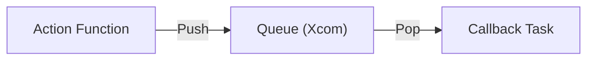

# Trigger and Scheduler Example

Shows event-driven and scheduled tasks.

## Triggers

Triggers fire on custom events and call callback tasks:

```python
BaseTrigger(
    name="my-trigger",
    queue_name="my-queue",
    action=trigger_action,         # Called first
    callback=Callback(              # Called for each queue item
        task=my_task,
        input_mapping={"msg": "{ctx.xcom['my-queue'].pop()}"},
    ),
)
```

## Schedulers

Schedulers run on time intervals:

```python
Scheduler(
    name="hourly",
    schedule="@hourly",
    queue_name="hour-queue",
    callback=Callback(task=my_task, ...),
)
```

## Running

```bash
cd examples/trigger-scheduler

# Run trigger (fires callbacks for each queue item)
zrb queue-trigger

# Run scheduler (runs on schedule)
zrb minutely

# Run trigger with multiple items
zrb multi-trigger
```

## Schedule Formats

| Format | Meaning |
|--------|---------|
| `@minutely` | Every minute |
| `@hourly` | Every hour |
| `@daily` | Every day |
| `@weekly` | Every week |
| `*/5 * * * *` | Cron: every 5 minutes |
| `0 9 * * *` | Cron: daily at 9AM |

## How It Works



1. **Action** runs and pushes items to queue
2. **Queue** stores items
3. **Callback** runs for each item popped

## Key Concepts

| Concept | Description |
|---------|-------------|
| `BaseTrigger` | Event-driven trigger |
| `Scheduler` | Time-based trigger |
| `queue_name` | Where to store items |
| `action` | Function to run first |
| `callback` | Task to call for each item |
| `input_mapping` | Map queue data to task inputs |

## Input Mapping

```python
input_mapping={
    "message": "{ctx.xcom['queue-name'].pop()}"
}
```

Maps the popped queue value to the task's input.
