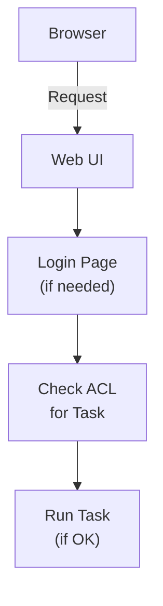

# Web Auth Example

Shows how to configure authentication for Zrb's web UI.

## Quick Setup

```python
from zrb import User
from zrb.config.web_auth_config import web_auth_config

# Enable authentication
web_auth_config.enable_auth = True

# Add users
web_auth_config.append_user(
    User(
        username="admin",
        password="secret",
        accessible_tasks=["*"],  # All tasks
    )
)

# Set guest-accessible tasks
web_auth_config.guest_accessible_tasks = ["public-task"]
```

## Running

```bash
cd examples/web-auth

# Start web UI (port defaults to 21213; override with ZRB_WEB_HTTP_PORT)
ZRB_WEB_HTTP_PORT=8000 zrb server start

# Access http://localhost:8000
```

## User Configuration

### Full Access User

```python
User(
    username="admin",
    password="admin123",
    accessible_tasks=["*"],  # All tasks
)
```

### Limited Access User

```python
User(
    username="jack",
    password="jack123",
    accessible_tasks=["hello", "greet"],  # Only these
)
```

### Guest Access

```python
# Tasks visible to unauthenticated users
web_auth_config.guest_accessible_tasks = ["hello"]
```

## Access Matrix

| User | Tasks |
|------|-------|
| Guest | `hello` |
| `jack` | `hello`, `greet` |
| `admin` | ALL (`*`) |

## Authentication Flow



## Key Concepts

| Concept | Description |
|---------|-------------|
| `enable_auth` | Turn on authentication |
| `append_user()` | Add a user |
| `accessible_tasks` | Tasks user can run |
| `*` | Wildcard for all tasks |
| `guest_accessible_tasks` | Public tasks |

## Security Notes

1. **Use strong passwords** in production
2. **Limit guest access** to non-sensitive tasks
3. **Use environment variables** for credentials:

```python
import os

web_auth_config.append_user(
    User(
        username="admin",
        password=os.environ.get("ADMIN_PASSWORD", "change-me"),
        accessible_tasks=["*"],
    )
)
```

4. **HTTPS is required for non-localhost.** Auth cookies are issued with
   `HttpOnly`, `Secure`, and `SameSite=Lax`. The `Secure` flag means browsers
   only send them over HTTPS — modern browsers treat `http://localhost` as a
   secure context (so local dev works), but any non-localhost deployment must
   terminate TLS in front of Zrb or cookie-based login will silently fail.
5. **Tokens.** Only *access* tokens authenticate a request; a *refresh* token is
   accepted solely at the refresh endpoint. Passwords are compared in constant
   time, but are stored as configured (plaintext) — keep them in env vars / a
   secret store, never in source.
