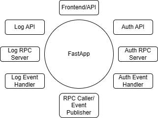
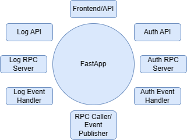
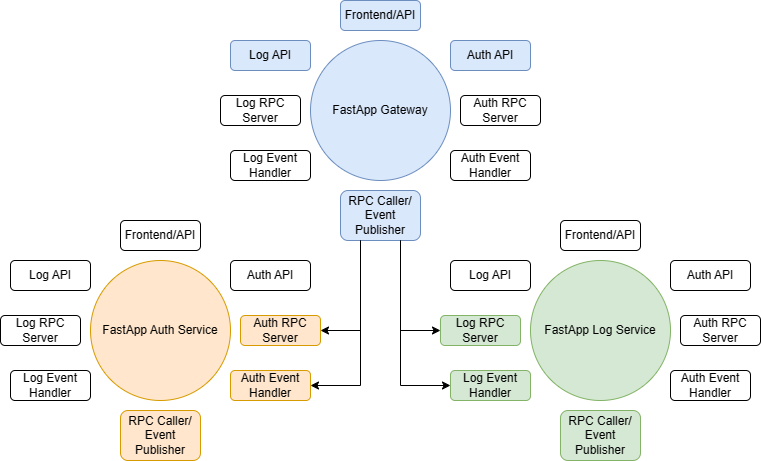

🔖 [Table of Contents](../README.md)

# Modular Monolith

PascalZrbAppName has several features that you can activate/deactivate using environment variables. It also has some communication patterns like API, RPC, or Event.



## Frontend, API, Event, and RPC

First, you have Frontend and API.

Frontend is intended to be accessed by users. It has buttons, links, and a nice user interface. This user interface usually needs to access API endpoints to translate user action into server requests.

Aside from the Frontend, the API endpoints are also accessible by external systems. You might have third-party client apps, webhook, or even IOT devices.

In PascalZrbAppName, most API requests will be translated into events/RPC calls. The difference between events and RPC calls is as follows:

- Event
    - Once an event is fired, event handlers will pick up the message.
    - PascalZrbAppName will not wait for the process to be completed. It just fires the event, lets the event handler handles the message, and continues with other processes.
    - You usually use events if you don't need an immediate response. For example:
        - You train a machine learning model. The process can take hours or even days. You just want to trigger the training, and you don't need immediate results. Once the training has been completed, you can let the event handler send a notification email to the user.
        - You deal with warehouse fulfillment progress. The fulfillment might take a very long time, you can't make sure that the user will get immediate feedback.
- RPC (Remote procedure call)
    - Once an RPC call is fired, RPC Server will pick up the message.
    - PascalZrbAppName will wait for the RPC Server to return the result before continuing with other processes.
    - You usually use RPC calls if you need an immediate response. For example:
        - You want to fetch user data from the database. You can't give any HTTP Response before you get the result from the database
        - You want to update a product description. You can only return HTTP Response to the user once the process is completed (or failed).

## Feature flags

The following are some feature flags to activate/deactivate the features:

- Frontend:
    - `ZRB_ENV_PREFIX_APP_ENABLE_FRONTEND=true`
- API:
    - `ZRB_ENV_PREFIX_APP_ENABLE_API=true`
- RPC Caller/Event Publisher: This feature is always activated
- Auth module:
    - Auth API:
        - `ZRB_ENV_PREFIX_APP_ENABLE_AUTH_MODULE=true`
        - `ZRB_ENV_PREFIX_APP_ENABLE_API=true`
    - Auth RPC Server:
        - `ZRB_ENV_PREFIX_APP_ENABLE_AUTH_MODULE=true`
        - `ZRB_ENV_PREFIX_APP_ENABLE_RPC_SERVER=true`
    - Auth Event Handler:
        - `ZRB_ENV_PREFIX_APP_ENABLE_AUTH_MODULE=true`
        - `ZRB_ENV_PREFIX_APP_ENABLE_EVENT_HANDLER=true`
- Log module:
    - Log API:
        - `ZRB_ENV_PREFIX_APP_ENABLE_LOG_MODULE=true`
        - `ZRB_ENV_PREFIX_APP_ENABLE_API=true`
    - Log RPC Server:
        - `ZRB_ENV_PREFIX_APP_ENABLE_LOG_MODULE=true`
        - `ZRB_ENV_PREFIX_APP_ENABLE_RPC_SERVER=true`
    - Log Event Handler:
        - `ZRB_ENV_PREFIX_APP_ENABLE_LOG_MODULE=true`
        - `ZRB_ENV_PREFIX_APP_ENABLE_EVENT_HANDLER=true`

By activating/deactivating the feature flags, you can control PascalZrbAppName's communication pattern. You can make it respond to all API requests, events, and RPC calls. Or you can make it respond to API requests but ignores RPC/Event calls.


# PascalZrbAppName as a monolith

PascalZrbAppName will behave like a monolith if you activate all the features.



A Monolith handles everything. Compared to microservices, a monolith is easier to maintain/deploy.

If you only have a single developer team, a monolith is much preferable.

However, since everything run in a single application, a problem in any component can affect the whole system. For example, if your Auth RPC Server takes up a lot of CPU usage, you might not be able to handle the event log.

Scaling a monolith application might also be challenging. The easiest way to scale up a monolith application is by using a more resourceful (and expensive) server. This probably won't be a good idea if your application receives spike requests once in a while. You will have to pay for the highest capacity all the time.

# PascalZrbAppName as a microservices

You can spawn multiple PascalZrbAppName, each with different configurations. By doing so, you can have a distributed architecture where some of your applications are deployed on cheaper Virtual Machines (like [Spot Instances](https://docs.aws.amazon.com/AWSEC2/latest/UserGuide/using-spot-instances.html)).

Furthermore, you can spawn more services if you encounter spiked requests. For example, there is a flash sale and you only need to spawn more services to handle sales orders. Once the flash sale ended, you can scale down your services.



Microservices are more difficult to deploy/maintain since you have multiple instances of your services.

You will likely need different teams to handle each service.

# Run PascalZrbAppName as a Monolith or Microservices

By using [Zrb](https://pypi.org/project/zrb), you will be able to run PascalZrbAppName as either a Monolith or Microservices. You don't need to set the feature flags manually.

```bash
# Run PascalZrbAppName as a monolith
zrb project start-kebab-zrb-app-name --kebab-zrb-app-name-run-mode monolith

# Run PascalZrbAppName as a monolith inside a container
zrb project start-kebab-zrb-app-name-container --kebab-zrb-app-name-run-mode monolith

# Run PascalZrbAppName as microservices
zrb project start-kebab-zrb-app-name --kebab-zrb-app-name-run-mode microservices

# Run PascalZrbAppName as microservices inside containers
zrb project start-kebab-zrb-app-name-container --kebab-zrb-app-name-run-mode microservices

# Deploy PascalZrbAppName to Kubernetes as a monolith
zrb project deploy-kebab-zrb-app-name --kebab-zrb-app-name monolith

# Deploy PascalZrbAppName to Kubernetes as a microservices
zrb project deploy-kebab-zrb-app-name --kebab-zrb-app-name microservices
```

Hopefully this will make your development/deployment process easier.

You can run your application as a monolith in your local computer, and deploy it as microservices later.


🔖 [Table of Contents](../README.md)
