# Chart and layout types

Each of these is individually small, so they share one file. All render; each is line-oriented and unforgiving about its own shape, so follow the forms below.

## pie

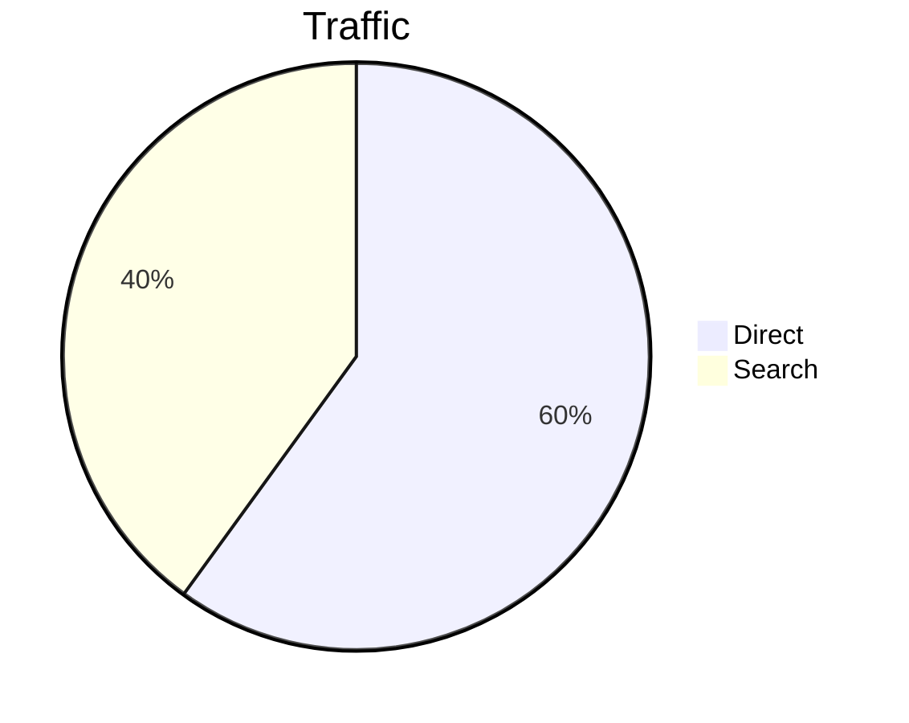

Supports `title`, `showData`, and `%%` comments. It is drawn as bars, not a circle.

## mindmap

Indentation-based nesting. Write labels **plain** — shape markers are *not* stripped in this version, so `root((Project))` renders with the parentheses visible.

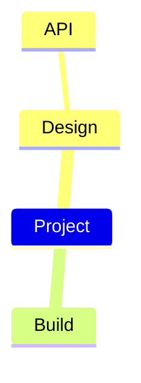

## gitGraph

`commit` (with `id:`, `type:`, `tag:`), `branch`, `checkout`/`switch`, `merge`, `cherry-pick`. Commit types `NORMAL`, `REVERSE`, `HIGHLIGHT`. This is the only diagram type that honours a `%%{init: …}%%` directive.

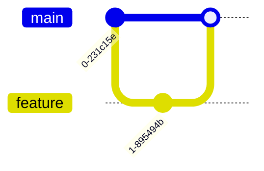

## gantt

Needs `dateFormat` and at least one `section`.

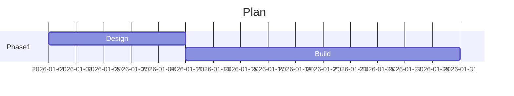

## quadrantChart

The keyword is case-sensitive — `quadrantchart` falls through to the flowchart parser and renders as boxes of your source.

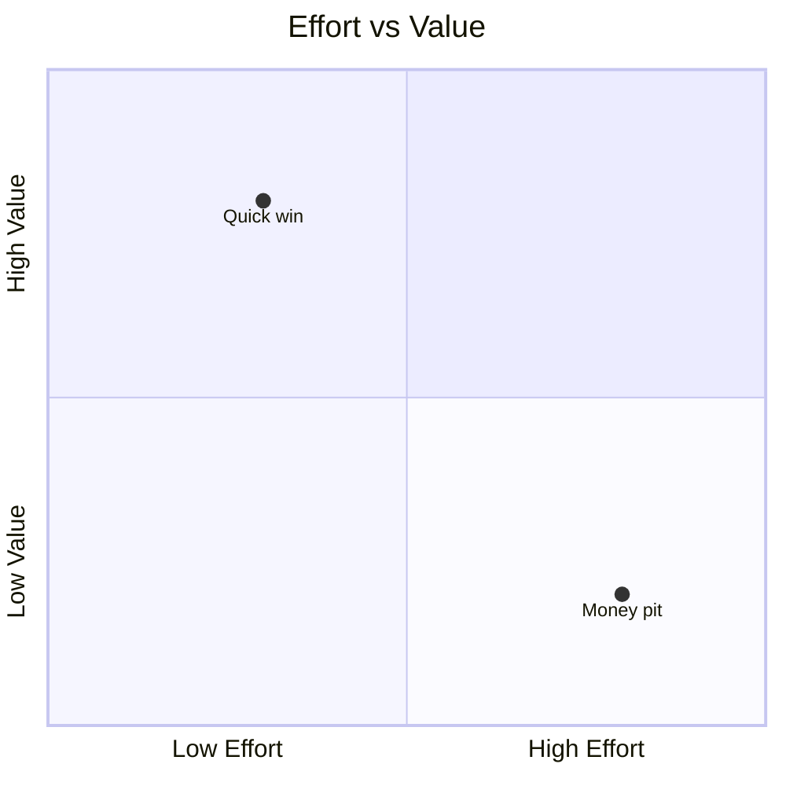

## architecture-beta

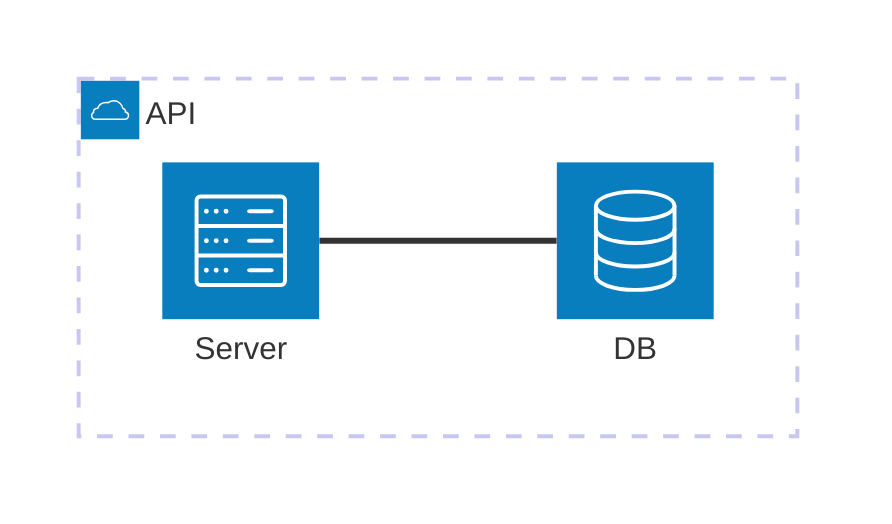

## timeline, journey, xychart-beta, block-beta, packet-beta, treemap-beta, kanban

Standard Mermaid syntax for each; all verified rendering.

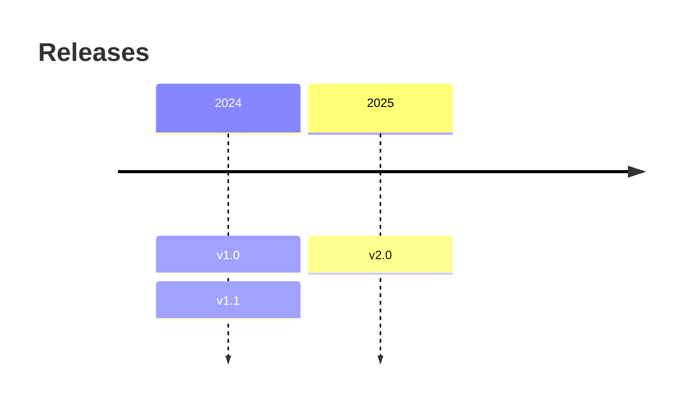

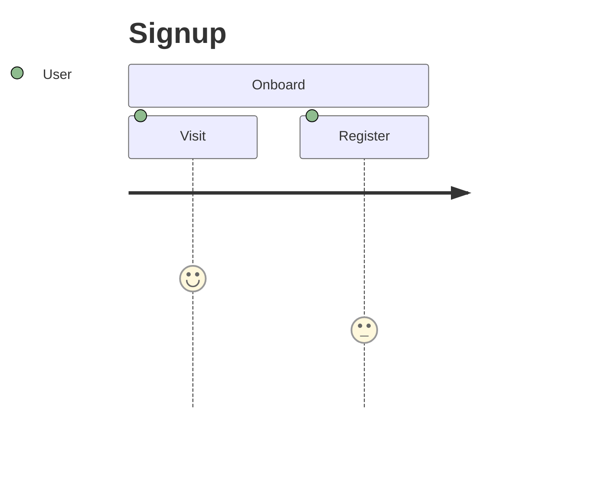

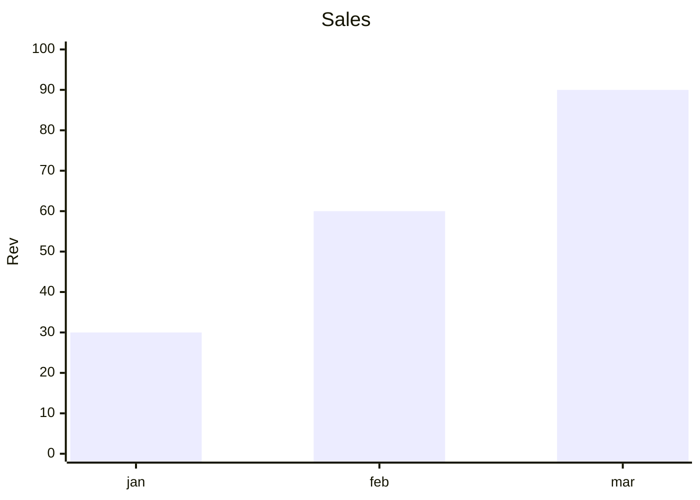

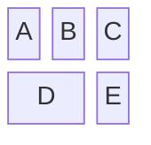

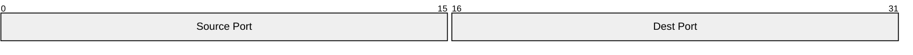

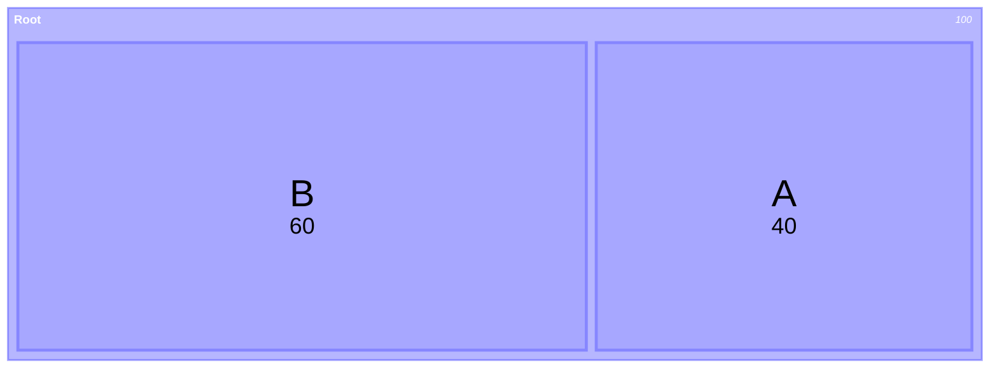

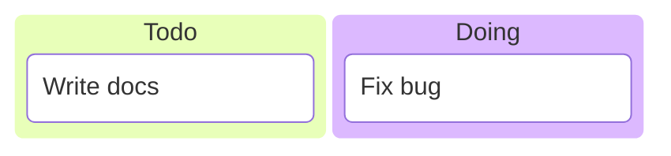

## Calling `termaid` directly (rarely needed)

`render(source, *, use_ascii=False, padding_x=4, padding_y=2, rounded_edges=True, gap=4)`. The parameter names differ from the CLI flags (`use_ascii`, not `ascii`). `padding_x` and `gap` are forwarded to non-flowchart renderers **only when they differ from the default 4**, and `padding_y` / `rounded_edges` are ignored by most non-flowchart types — so passing the defaults explicitly is not the same as passing nothing.
