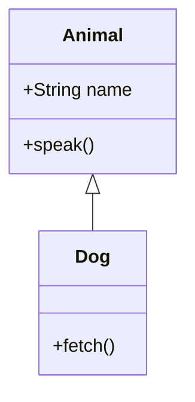

# classDiagram

**Supported.** `direction TB/LR/BT/RL`; `class X { … }` bodies and bare `class X`; the colon form `X : +member()`; visibility `+ - # ~`; the classifiers `$` (static) and `*` (abstract); return types (`+getName() String`, `+String name`); stereotypes `<<interface>>` inline or on their own line; all relations — `<|--`, `*--`, `o--`, `<--`, `-->`, `..>`, `..|>`, `--*`, `..o`, `<|..`; cardinality on both ends (`"1" --> "*"`); relation labels (`: has`); `note for X "…"` and floating `note "…"`.

**Not supported.** `namespace`, `style`, `classDef`, `cssClass`, `click`, `callback`, `link` — all dropped silently. Generic parameters parse but are **discarded**: `class Gen~T~` renders as a class named `Gen`, so write the concrete name you want shown.
