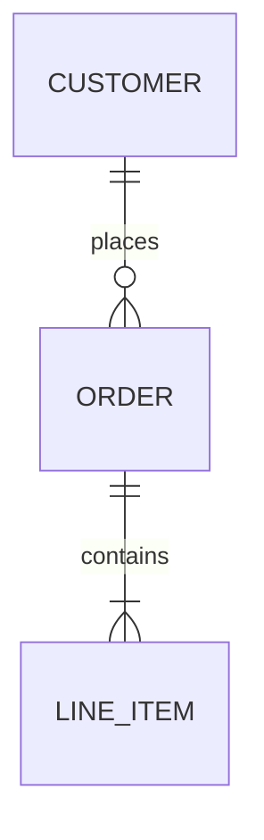

# erDiagram

**The relationship label is mandatory.** `CUSTOMER ||--o{ ORDER` with no `: label` does not merely lose the label — **the entire diagram renders empty**. This is the easiest way to get a blank diagram out of an otherwise reasonable-looking file.

**Supported.** Symbol cardinality `||`, `|o`, `}|`, `}o` against `||`, `o|`, `|{`, `o{`; the word aliases (`zero or one`, `zero or more`, `one or more`, `only one`, `to`, `optionally to`, `1`, `0+`, `1+`); solid `--` and dashed `..` lines; quoted entity names (`"DELIVERY ADDRESS"`) and hyphenated ones (`LINE-ITEM`); entity bodies with `type name PK,FK "comment"`; entity aliases (`p[Person] { }`); standalone entities on their own line; `direction`. `style`, `classDef` and `%%` are skipped harmlessly.
