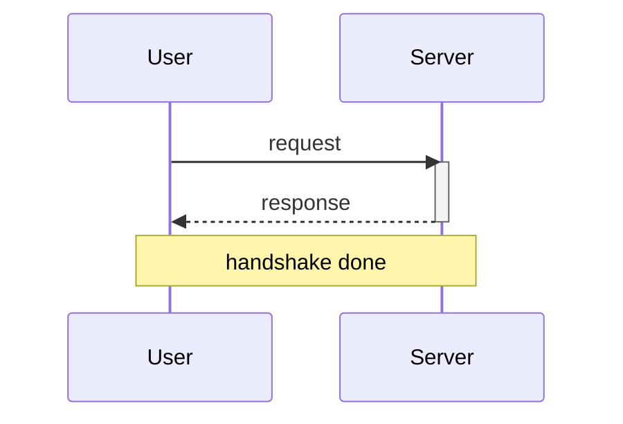

# sequenceDiagram

**Supported.** `participant X as Y`; the kinds `actor`, `database`, `queue`, `boundary`, `control`, `entity`, `collections`; `create participant X` and `destroy X`; arrows `->>`, `-->>`, `->`, `-->`, `-x`, `--x`, `-)`, `--)` and the bidirectional `<<->>`, `<<-->>`; `activate`/`deactivate` and the inline `A->>+B:` / `A->>-B:` form; `Note over A`, `Note over A,B`, `Note left of`, `Note right of`; the blocks `loop`, `alt`/`else`, `opt`, `par`/`and`, `critical`/`option`, `break`, `rect`, nested freely; bare `autonumber`; `%%` comments.

**Not supported — these disappear or corrupt:**

| Construct | Result |
| --- | --- |
| `title X` | silently dropped |
| `box … end` | the label is dropped **and** its `end` pops the block stack, so a `box` inside a `loop` closes the wrong block |
| `autonumber 10 10` | the arguments are not matched; only bare `autonumber` works |
| `links`, `link`, `menu` | dropped |

` ` **is** converted to a real line break inside a `Note` — one of only two places in the whole renderer where that is true (the other is a state-diagram `note`).
