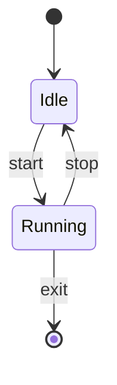

# stateDiagram / stateDiagram-v2

**Supported.** Both `stateDiagram` and `stateDiagram-v2`; `direction LR`; `[*]` as start and end (each occurrence becomes its own terminal marker, ● and ◉); transition labels via `: label`; `state "Long name" as alias`; the stereotypes `<<fork>>`, `<<join>>`, `<<choice>>`; composite states (`state Parent { … }`, nested); **single-line** notes — `note right of X : text` or `note left of X : text` — in which ` ` becomes a real line break.

**Not supported:**

| Construct | Result |
| --- | --- |
| `note over X` | dropped — only `left of` / `right of` are matched |
| multi-line `note … end note` | **corrupting.** The note is dropped, and any body line that is a single bare word becomes a **phantom state node**. Verified: a note body of `multi` renders as a floating state box named `multi`. |
| `classDef`, `:::class` | dropped silently |

Use only the single-line `note right of X : …` form.
