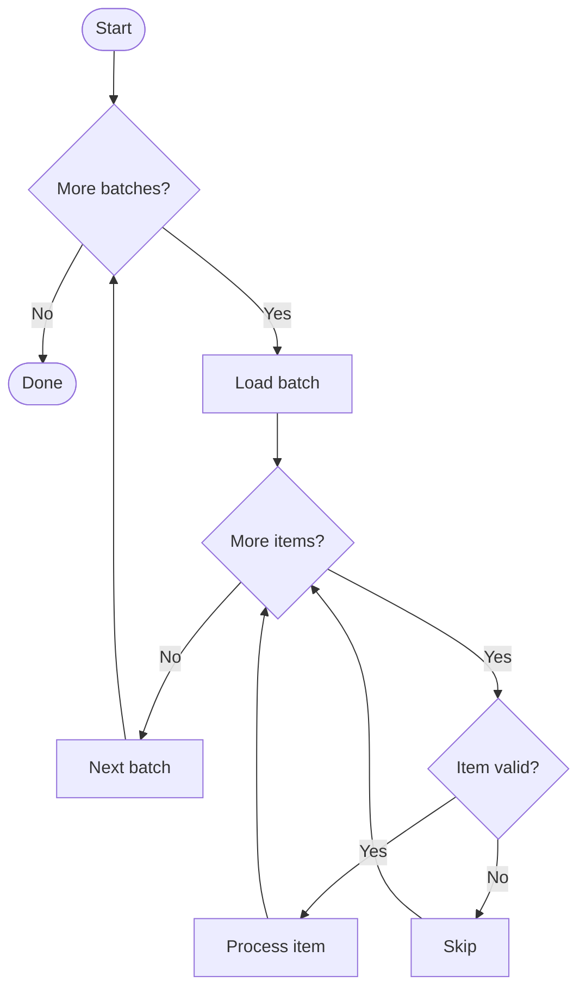

# Skill: mermaid-diagrams

A ` ```mermaid ` fence in your response is rendered to Unicode box-drawing art by `termaid` when the response is displayed. `termaid` implements its own line-oriented parsers rather than Mermaid's grammar, so some perfectly valid Mermaid renders wrong — and it almost never raises. The rules below are the ones whose violation is silent.

## 1. Only these diagram types are safe

| Keyword | | Keyword | |
| --- | --- | --- | --- |
| `flowchart` / `graph` | full support | `pie` | |
| `sequenceDiagram` | | `mindmap` | |
| `classDiagram` | | `timeline` | |
| `stateDiagram` / `-v2` | | `journey` | |
| `erDiagram` | | `quadrantChart` | case-sensitive |
| `gantt` | | `xychart` / `-beta` | |
| `gitGraph` | | `block` / `-beta` | |
| `kanban` | | `packet` / `-beta` | |
| `treemap` / `-beta` | | `architecture` / `-beta` | |

**Anything not on this list is not rejected — it is silently mangled.** Type dispatch is a `startswith` chain whose fall-through is the flowchart parser, which turns every remaining line of your source into a node box. `requirementDiagram` renders as three boxes reading `requirement r {`, `id: 1`, `}`. The same happens to `sankey`, `C4Context` and friends, `radar`, and `zenuml`. If the user needs one of those, say it will not render rather than emitting it.

## 2. Edge labels: always the pipe form, never inline

Write `A -->|text| B`. Every arrow style has a pipe variant — `-->|t|`, `-.->|t|`, `==>|t|`, `--o|t|`, `--x|t|` — and all of them are safe. The inline forms are not:

| Inline form | What happens |
| --- | --- |
| `A -- "t" --> B` | label is **dropped entirely** |
| `A -- t --> B` | label survives, but the edge is drawn 3× longer (all four dashes count toward its length), which stretches the whole diagram |
| `A == t ==> B` | label survives, layout distorted the same way |
| `A -.t.-> B` | **parse failure** — no arrow is found and the entire statement becomes one node named `A -.t.-> B` |
| `A -. t .-> B` | works, but only because of the spaces — one character away from the line above |

There is no case where an inline label is better, and two where it silently destroys output. Use the pipe form unconditionally.

## 3. Quote any label containing `<` or `>`

`A[Line1<br/>Line2]` renders as a single box reading `Line2` — **"Line1" is silently gone**, because the `>…]` asymmetric-node pattern is matched before the `[…]` rectangle pattern. Quoting (`A["Line1<br/>Line2"]`) preserves the text, but then `<br/>` prints as the literal four characters.

`<br/>` becomes a real line break in exactly one place: inside a sequence-diagram `Note` or a state-diagram `note`. Everywhere else — flowchart nodes and edges, class members, state transitions, ER attributes — keep labels short and let the renderer wrap them, or split the content across nodes.

## 4. Keep every statement on one physical line

The parsers are line-oriented, so a line break inside a label truncates or corrupts: a sequence message silently loses everything after the break, a state diagram gains a phantom state, and a pipe-labeled flowchart edge breaks. Write the whole statement, label included, on one line.

## 5. Declare a shared edge once

For a node with several children write the parent edge once (`P --> G`) and chain each child from there (`G --> G1`, `G --> G2`). Repeating the full path per child (`P --> G --> G1`, `P --> G --> G2`) does not deduplicate — it renders as separate overlapping arrows into the same node.

## What flowcharts do support

Don't hedge around these; they all work. All 14 node shapes (`[]`, `()`, `([])`, `[[]]`, `[()]`, `(())`, `((()))`, `>]`, `{}`, `{{}}`, `[//]`, `[\\\\]`, `[/\\]`, `[\\/]`, plus `@{shape: …}`); all four directions; `subgraph`/`end`, including nesting and a per-subgraph `direction`; `%%` comments; `&` chaining (`A & B --> C`); `classDef`, `:::class`, `style`, `linkStyle`; `;` separators; and arrow-length control (`--->` is drawn longer than `-->`).

## Worked example

A nested loop with a branch at each level, in fully safe form:



## Emitting the fence

Write the fence directly into your response — it renders on display, so **do not write it to a file or pipe it through the `termaid` CLI to check your own syntax.** These rules are that check, and a preview round trip shows the user nothing they were not about to see. Write the diagram to a file only when the user asks you to; that is their call, not this skill's.

## Traps outside flowcharts that destroy output

Know these even if you don't open a companion — each one fails silently:

| Type | Trap |
| --- | --- |
| `erDiagram` | a relationship **must** carry `: label`. `A ||--o{ B` with no label renders the **entire diagram empty** |
| `sequenceDiagram` | `title` is dropped; `box … end` corrupts block nesting because its `end` closes the wrong block |
| `stateDiagram` | multi-line `note … end note` drops the note and turns single-word body lines into **phantom states** — use `note right of X : text` |
| `classDiagram` | `class Gen~T~` discards the generic parameter and renders as `Gen` |
| `mindmap` | shape markers are not stripped — `root((X))` renders the parentheses literally; write plain labels |
| `quadrantChart` | case-sensitive; `quadrantchart` falls through to the flowchart parser |

## Per-type syntax

When the current step matches a trigger below, `Read` the named companion from this skill's directory (the activation header lists the directory path and all companion paths). Companions are not pre-loaded — pull them on demand, and pull only the one you need.

| Trigger | Companion |
| --- | --- |
| Emitting a sequence diagram | `reference/sequence.md` |
| Emitting a class diagram | `reference/class.md` |
| Emitting a state diagram | `reference/state.md` |
| Emitting an ER diagram | `reference/er.md` |
| Emitting pie, mindmap, gitGraph, gantt, quadrant, timeline, journey, xychart, block, packet, treemap, kanban, or architecture | `reference/charts.md` |
| Emitting a flowchart | none — this file is complete for flowcharts |
